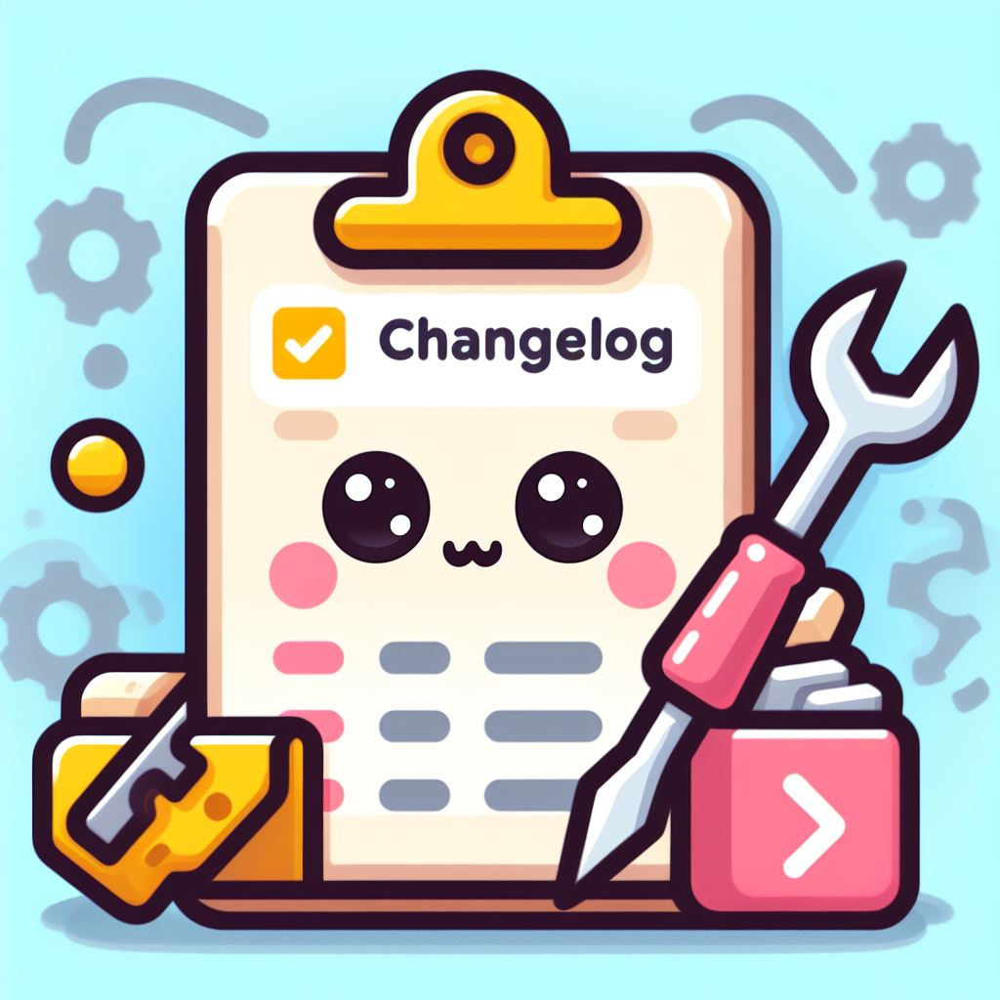

<p align="center">
  
</p>

<h1 align="center">AutoChangelog</h1>

<p align="center">
  <i>Gera e mantém o <code>CHANGELOG.md</code> do seu projeto a partir do histórico do Git — com ou sem IA.</i>
</p>

<p align="center">
  <a href="#sobre">Sobre</a> •
  <a href="#instalação">Instalação</a> •
  <a href="#uso">Uso</a> •
  <a href="#github-action">GitHub Action</a> •
  <a href="#modo-com-ia">Modo com IA</a> •
  <a href="#configuração">Configuração</a> •
  <a href="#desenvolvimento">Desenvolvimento</a>
</p>

## Sobre

O AutoChangelog lê as tags e os commits do seu repositório e escreve um `CHANGELOG.md` no padrão
[Keep a Changelog](https://keepachangelog.com/pt-BR/1.1.0/), em português:

- **Uma seção por versão**: cada tag no formato de versão (`v1.2.0`, `1.2.0`) vira um lançamento com
  a data da tag; os commits depois da última tag ficam em **[Não lançado]**.
- **Agrupado por tipo de mudança**, a partir de [Conventional Commits](https://www.conventionalcommits.org/pt-br/)
  (com ou sem [gitmoji](https://gitmoji.dev/)):

  | Tipo de commit                          | Seção            |
  | --------------------------------------- | ---------------- |
  | `feat`                                  | Adicionado       |
  | `refactor`, `perf`                      | Alterado         |
  | `deprecate`                             | Obsoleto         |
  | `revert`, `remove`                      | Removido         |
  | `fix`                                   | Corrigido        |
  | `security`                              | Segurança        |
  | `tipo!:` ou rodapé `BREAKING CHANGE:`   | ⚠️ Incompatível  |
  | `docs`, `chore`, `test`, `ci`, `build`, `style` | Outros (só com `--incluir-todos`) |
  | Commits fora do padrão                  | Alterado         |

  Linhas do corpo do commit que também seguem o padrão (como as geradas pelo
  [OpenCommit](https://github.com/di-sukharev/opencommit)) viram itens extras.
- **Links** para cada commit e comparações entre versões no GitHub e no GitLab.
- **Atualização segura**: versões que já estão no arquivo são mantidas exatamente como estão (inclusive
  suas edições manuais); só versões novas são adicionadas e o bloco [Não lançado] é refeito. Rodar
  duas vezes seguidas não muda nada.
- **Com ou sem IA**: sem IA o resultado é determinístico; com IA (Anthropic, OpenAI ou Ollama) as
  entradas são reescritas em linguagem clara para quem usa o projeto.
- **Sem dependências** no modo sem IA — só Python e Git.

Exemplo de saída:

```markdown
## [1.1.0] - 2026-03-10

### Adicionado

- **cli:** Adiciona a opção --simular ([a1b2c3d](https://github.com/dono/projeto/commit/a1b2c3d...))

### Corrigido

- Corrige falha ao ler arquivos vazios ([e4f5a6b](https://github.com/dono/projeto/commit/e4f5a6b...))
```

## Instalação

Requisitos: **Python 3.11+** e **Git**.

```shell
pip install git+https://github.com/manteguinha/AutoChangelog.git

# com suporte à Anthropic (Claude)
pip install "autochangelog[anthropic] @ git+https://github.com/manteguinha/AutoChangelog.git"
```

Ou, a partir de um clone:

```shell
git clone https://github.com/manteguinha/AutoChangelog.git
cd AutoChangelog
pip install .
```

## Uso

```shell
autochangelog                      # gera/atualiza o CHANGELOG.md do diretório atual
autochangelog caminho/do/projeto   # em outro repositório
autochangelog --simular            # mostra o resultado sem gravar
autochangelog --versao 1.2.0       # lança as mudanças pendentes como 1.2.0 (data de hoje)
autochangelog --versao auto        # usa a versão do package.json, pyproject.toml, Cargo.toml, composer.json ou VERSION
autochangelog --incluir-todos      # inclui docs, testes, CI e manutenção em "Outros"
autochangelog --regenerar          # recria o arquivo do zero
```

Também funciona com `python -m autochangelog`.

| Opção                   | Descrição                                                                 |
| ----------------------- | ------------------------------------------------------------------------- |
| `DIRETORIO`             | Repositório Git (padrão: diretório atual).                                |
| `-s`, `--saida`         | Arquivo de saída, relativo à raiz do repositório (padrão: `CHANGELOG.md`). |
| `-v`, `--versao`        | Lança as mudanças pendentes como a versão informada, ou `auto`.           |
| `--ia`                  | `nenhuma` (padrão), `anthropic`, `openai` ou `ollama`.                    |
| `-m`, `--modelo`        | Modelo do provedor de IA.                                                 |
| `--incluir-todos`       | Inclui mudanças internas na seção "Outros".                               |
| `--url-repositorio`     | URL web do repositório para os links (padrão: detectada do `origin`).    |
| `--regenerar`           | Descarta o conteúdo atual e recria o arquivo.                             |
| `--simular`             | Imprime o resultado em vez de gravar.                                     |
| `-q`, `--silencioso`    | Mostra apenas avisos e erros.                                             |
| `-V`, `--versao-ferramenta` | Mostra a versão do AutoChangelog.                                     |

### Fluxo de lançamento sugerido

```shell
autochangelog --versao 1.2.0
git add CHANGELOG.md && git commit -m "docs: changelog da versão 1.2.0"
git tag v1.2.0 && git push --follow-tags
```

### Atualizar a cada commit (hook)

```shell
autochangelog hook instalar     # cria .git/hooks/post-commit
autochangelog hook remover
```

O hook atualiza o `CHANGELOG.md` após cada commit (a alteração fica pronta para o próximo commit). Um
hook `post-commit` já existente não é substituído sem `--forcar`.

### Migrando de um CHANGELOG antigo

Se o arquivo atual não estiver no formato Keep a Changelog (sem títulos `## [versão]`), a ferramenta
não o altera e pede `--regenerar`, que recria o arquivo inteiro a partir do Git.

## GitHub Action

O AutoChangelog também roda como uma GitHub Action, para manter o changelog atualizado
automaticamente no repositório. O uso local continua igual; a Action usa o mesmo comando e lê o
mesmo `.autochangelog.toml`.

### Atualizar a cada push na `main`

Crie `.github/workflows/changelog.yml` no seu projeto:

```yaml
name: Changelog

on:
  push:
    branches: [main]

permissions:
  contents: write

jobs:
  changelog:
    runs-on: ubuntu-latest
    steps:
      - uses: actions/checkout@v4
        with:
          fetch-depth: 0 # histórico e tags completos
      - uses: manteguinha/AutoChangelog@main
        with:
          commit: true
```

Cada push refaz o bloco **[Não lançado]** e, se algo mudou, a Action faz commit do `CHANGELOG.md`.
Commits feitos com o `GITHUB_TOKEN` não disparam outro workflow, então não há loop.

### Lançar uma versão ao criar uma tag

```yaml
name: Changelog da versão

on:
  push:
    tags: ["v*"]

permissions:
  contents: write

jobs:
  changelog:
    runs-on: ubuntu-latest
    steps:
      - uses: actions/checkout@v4
        with:
          ref: main # o commit vai para a main, não para a tag
          fetch-depth: 0
      - uses: manteguinha/AutoChangelog@main
        with:
          commit: true
          mensagem-commit: "docs: changelog da versão ${{ github.ref_name }} [skip ci]"
```

### Conferir em pull requests

Sem `commit`, a Action só gera o arquivo no runner; use a saída `alterado` para avisar ou falhar:

```yaml
      - uses: manteguinha/AutoChangelog@main
        id: changelog
      - if: steps.changelog.outputs.alterado == 'true'
        run: git diff -- CHANGELOG.md
```

### Com IA

Guarde a chave em **Settings → Secrets and variables → Actions** e passe-a como variável de ambiente:

```yaml
      - uses: manteguinha/AutoChangelog@main
        with:
          ia: anthropic
          commit: true
        env:
          ANTHROPIC_API_KEY: ${{ secrets.ANTHROPIC_API_KEY }}
```

O pacote `anthropic` é instalado automaticamente quando o provedor é `anthropic`.

### Entradas e saídas

| Entrada           | Descrição                                                                   | Padrão |
| ----------------- | --------------------------------------------------------------------------- | ------ |
| `diretorio`       | Repositório Git a processar.                                                | `.` |
| `saida`           | Arquivo de saída, relativo à raiz do repositório.                           | configuração ou `CHANGELOG.md` |
| `versao`          | Lança as mudanças pendentes como esta versão, ou `auto`.                   | — |
| `ia`              | `nenhuma`, `anthropic`, `openai` ou `ollama`.                               | configuração ou `nenhuma` |
| `modelo`          | Modelo do provedor de IA.                                                   | — |
| `incluir-todos`   | `true` inclui mudanças internas na seção "Outros".                          | `false` |
| `url-repositorio` | URL web do repositório para os links.                                       | detectada do `origin` |
| `regenerar`       | `true` recria o arquivo do zero.                                            | `false` |
| `commit`          | `true` faz commit e push do changelog na branch do checkout.               | `false` |
| `mensagem-commit` | Mensagem do commit.                                                         | `docs: atualiza o CHANGELOG.md [skip ci]` |
| `python-version`  | Python usado pela ferramenta (3.11+).                                       | `3.12` |

| Saída      | Descrição                                                  |
| ---------- | ---------------------------------------------------------- |
| `alterado` | `true` se o changelog foi criado ou alterado.              |
| `arquivo`  | Caminho do changelog relativo à raiz do repositório.       |
| `commit`   | SHA do commit criado (quando `commit` é `true`).           |

Observações:

- Use `fetch-depth: 0` no `actions/checkout`; com um checkout raso o changelog fica incompleto (a
  Action avisa).
- `commit: true` precisa de `permissions: contents: write` e de uma branch no checkout. Em tags e
  pull requests, informe `ref:` no `actions/checkout`.
- A Action roda em um ambiente Python isolado e não altera o Python do restante do job.
- `@main` sempre usa a versão mais recente. Para fixar uma versão, use uma tag (ex.: `@v2`) ou o SHA
  de um commit.

## Modo com IA

Com `--ia`, os commits de cada lançamento são enviados ao provedor escolhido, que devolve os itens
reescritos e agrupados nas mesmas seções. Se algo falhar (sem chave, sem conexão, resposta inválida),
aquele lançamento é gerado sem IA e um aviso é exibido — o changelog nunca fica sem ser gerado.
Versões que já estão no arquivo não são reenviadas.

| Provedor    | Como configurar                                                                                   | Modelo padrão   |
| ----------- | ------------------------------------------------------------------------------------------------- | --------------- |
| `anthropic` | `pip install "autochangelog[anthropic]"` e `ANTHROPIC_API_KEY`                                   | `claude-opus-5` |
| `openai`    | `OPENAI_API_KEY`; `OPENAI_BASE_URL` para APIs compatíveis (Groq, OpenRouter, LM Studio...)      | `gpt-4o-mini`   |
| `ollama`    | Ollama rodando localmente; `OLLAMA_HOST` se não for `http://localhost:11434`                     | `llama3.1`      |

```shell
export ANTHROPIC_API_KEY=...
autochangelog --ia anthropic

autochangelog --ia ollama --modelo qwen2.5
```

## Configuração

As opções podem ficar em um arquivo `.autochangelog.toml` na raiz do repositório (ou na seção
`[tool.autochangelog]` do `pyproject.toml`). A linha de comando tem precedência.

```toml
saida = "CHANGELOG.md"
ia = "nenhuma"            # nenhuma | anthropic | openai | ollama
modelo = "claude-opus-5"
incluir_todos = false
url_repositorio = "https://github.com/dono/projeto"
tempo_limite_ia = 120     # segundos
```

## Desenvolvimento

```shell
pip install -e ".[dev]"
ruff check . && ruff format --check .
pytest
```

Estrutura:

```
autochangelog/
  cli.py           # linha de comando
  config.py        # leitura de .autochangelog.toml / pyproject.toml
  git.py           # tags, commits e remoto
  commits.py       # Conventional Commits
  categorias.py    # seções do Keep a Changelog
  gerador.py       # monta o changelog (com ou sem IA)
  renderizador.py  # Markdown
  arquivo.py       # atualização segura do arquivo existente
  versao.py        # detecção de versão
  hook.py          # hook post-commit
  ia/              # provedores Anthropic, OpenAI e Ollama
action.yml         # GitHub Action
tests/
```

## Contribuindo

1. Faça um fork do projeto
2. Crie uma branch (`git checkout -b feat/minha-feature`)
3. Faça commits no padrão Conventional Commits (`git commit -m "feat: minha feature"`)
4. Rode `ruff` e `pytest`
5. Abra um Pull Request

---

<p align="center">
  Feito com 💜 por <a href="https://mvms.dev" target="_blank">Marcos Vinicius</a>
</p>
